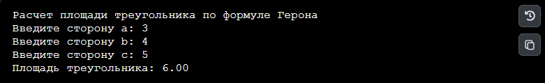
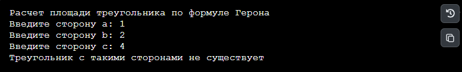
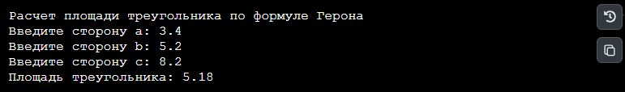
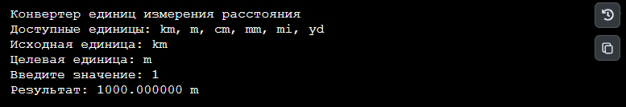
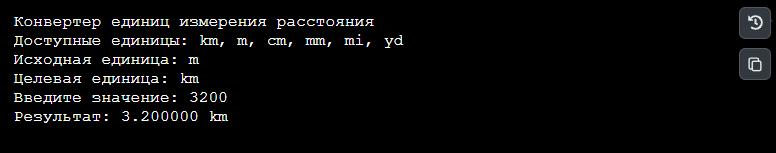
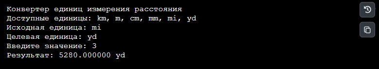
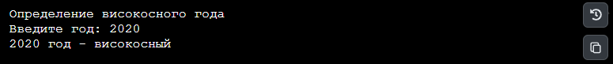
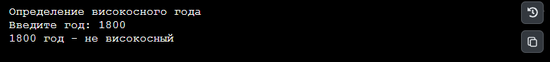
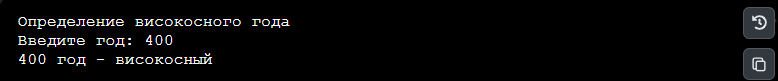

# Прикладное программирование

**Исполнитель:** Арсланов Руслан Айратович, группа Фт-250008.
**Направление:** 09.03.02 «Информационные системы и технологии».
**Курс:** 2, семестр: 3.

## Лабораторная работа №1 Функции ввода/вывода, условный оператор
### Формула герона 
Пользователь вводит стороны треугольника.
### Конвертер расстояний
Пользователь выбирает начальную систему исчисления и конечную. Затем вводит значение.
### Високосный год
Пользователь вводит год.
## Среда разработки
Язык программирования: Python

Среда разработки: Pycharm 2026.2.1

## Формулировка задания

| Проект                                                                                                                                                                                                     | Задание                                                                                                                                | Файл и команда запуска    |
| ---------------------------------------------------------------------------------------------------------------------------------------------------------------------------------------------------------------- | --------------------------------------------------------------------------------------------------------------------------------------------- | -------------------------------------------- |
| 1. Формула Герона                         | По трём сторонам вычислить площадь треугольника; проверить, существует ли он | `heron.py` — `python3 heron.py`         |
| 2. Конвертер расстояний | Перевести значение между km, m, cm, mm, mi и yd                                                                        | `converter.py` — `python3 converter.py` |
| 3. Високосный год                     | Определить, является ли введённый год високосным                                                    | `leap_year.py` — `python3 leap_year.py` |

## Инструкция по работе
### Формула Герона
По запросу программы нужно последовательно ввести стороны треугольника.
### Конвертер расстояний
Необходимо сначала выбрать системы исчисления, затем ввести значение в первой системе, чтобы получить значение во второй.
### Високосный год
Нужно ввести год.
## Результаты тестирования
### Формула Герона
Тест 1

Тест 2

Тест 3

### Конвертер расстояний
Тест 1

Тест 2

Тест 3

### Високосный год
Тест 1

Тест 2

Тест 3

